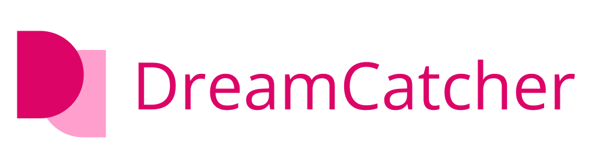
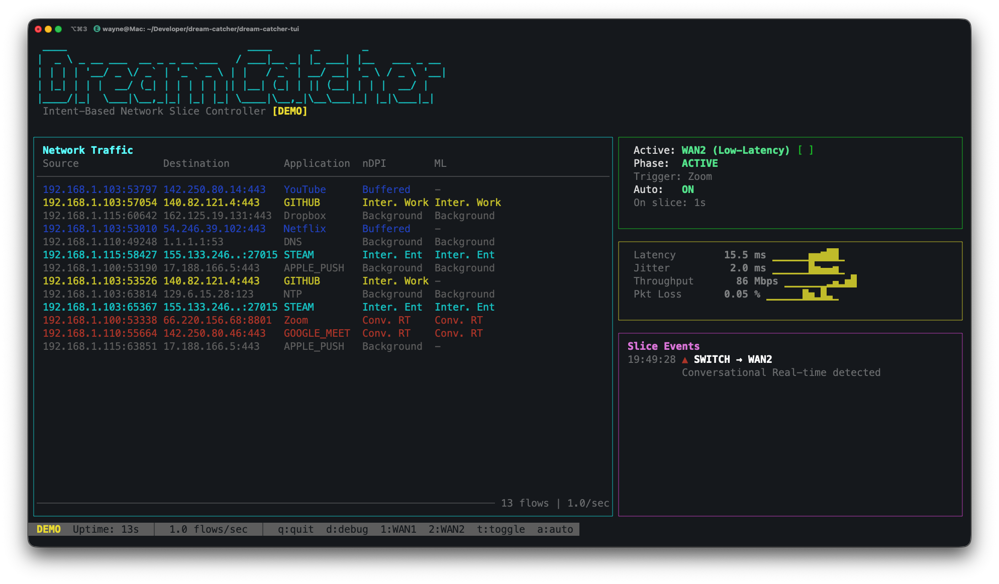
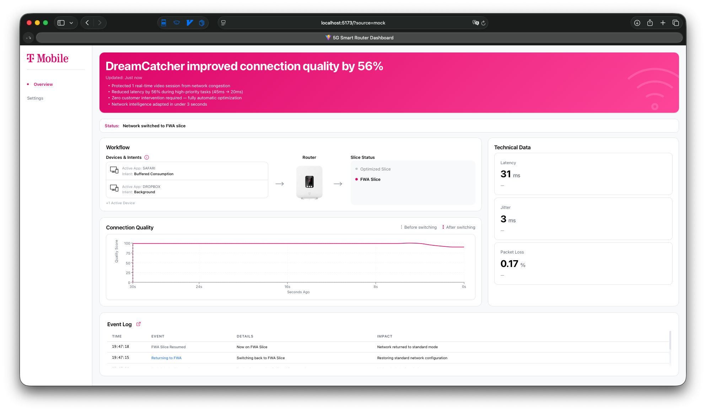
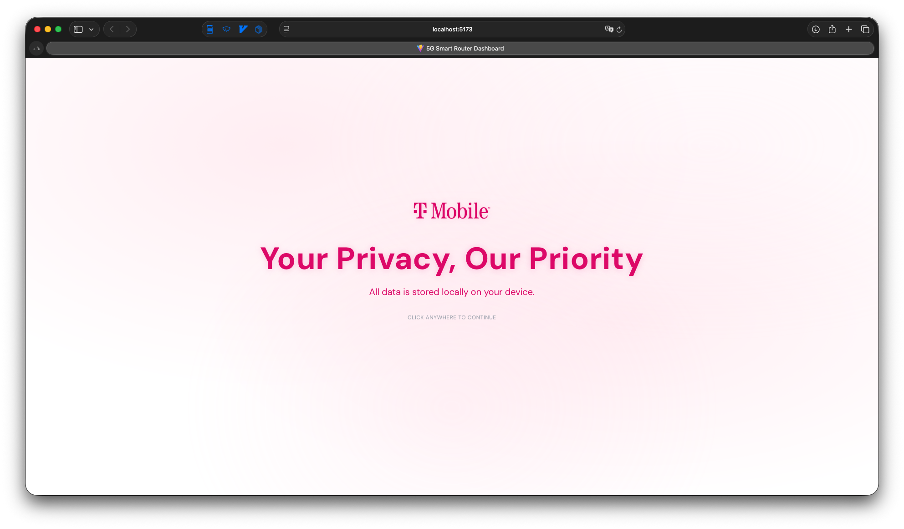

# Dream Catcher
## User Manual

---

| | |
|---|---|
| **Project Title** | Dream Catcher — Intent-Based 5G Network Slice Controller |
| **Version** | 1.0.0 |
| **Team Members** | Wayne Tsai, Marjorie Yang, Yourong Xu |
| **Instructor** | Luyao Niu, Mark Licata |
| **Industrial Sponsor** | T-Mobile (Sponsor Contact: Justin Ho) |
| **Submission Date** | March 12, 2026 |

---



---

## Table of Contents

1. [Product Overview](#1-product-overview)
2. [System Requirements](#2-system-requirements)
3. [Installation and Setup](#3-installation-and-setup)
4. [Operating Instructions](#4-operating-instructions)
5. [Technical Specifications](#5-technical-specifications)
6. [Security and Privacy](#6-security-and-privacy)
7. [Troubleshooting](#7-troubleshooting)
8. [Limitations](#8-limitations)

---

## 1. Product Overview

### What Is Dream Catcher?

Dream Catcher is an intelligent network management system for 5G home and small-office routers. It watches the network traffic on your connection in real time, figures out what kind of activity is happening (a video call, a game, regular browsing), and automatically switches the router to the best possible network configuration for that activity — without any manual input from the user.

Think of it as a smart traffic controller living inside your router. When it detects you have joined a Zoom meeting, it instantly prioritises the low-latency network path for that call. When the meeting ends, it quietly switches back to normal settings.

### The Problem It Solves

Standard home routers treat all network traffic the same way. A video call competes equally with a file download or a software update in the background. This causes dropped frames, choppy audio, and degraded call quality during the moments that matter most.

Dream Catcher eliminates this problem by continuously monitoring traffic, identifying high-priority applications, and dynamically reassigning network resources — automatically and in real time.

### Who Is It For?

| Audience | Use Case |
|----------|----------|
| Home users | Automatic quality improvement for video calls and gaming without any configuration |
| IT administrators | Monitor and control network slice behaviour across a pfSense-managed network |
| Business stakeholders | Visualise the measurable quality-of-experience improvement driven by intelligent slice switching |
| Network engineers | Extend or customise the intent classification and WAN switching logic |

### Primary Features

- **Automatic traffic classification** — identifies applications (Zoom, Teams, FaceTime, YouTube, Steam, etc.) by their network behaviour using deep packet inspection
- **Real-time WAN switching** — switches the active WAN gateway on a pfSense router the moment high-priority traffic is detected
- **Terminal UI** — a fullscreen live view of all network flows, current slice state, and network metrics
- **End-user dashboard** — a browser-based interface for home users to monitor router status and configure priority rules
- **Business dashboard** — a stakeholder-facing view showing quality-of-experience charts with before/after switch markers and business impact metrics
- **Demo mode** — a fully self-contained simulation that requires no router hardware, suitable for presentations and development

---

## 2. System Requirements

### Supported Operating Systems

| Component | Supported OS |
|-----------|-------------|
| Backend | macOS 12+, Linux (Ubuntu 20.04+, Debian 11+) |
| Frontend dashboards | Any OS with a modern browser (Chrome 110+, Firefox 110+, Safari 16+) |
| TUI — demo mode | macOS 12+, Linux |
| TUI — live mode | Linux only (requires raw packet capture; macOS has limitations with NFStream) |

### Hardware Requirements

**Minimum (demo mode / dashboards only):**
- CPU: dual-core 2 GHz
- RAM: 4 GB
- Disk: 500 MB free

**Live mode (full system):**
- CPU: quad-core 2 GHz recommended (NFStream is CPU-intensive during capture)
- RAM: 8 GB
- Network: a second network interface or SPAN/mirror port for packet capture
- Router: pfSense 2.7+ with two configured WAN gateways and a gateway group

### Software Dependencies

**All components:**
- Node.js 18 or later
- npm 9 or later

**TUI live mode only:**
- Python 3.12 or later
- pip packages: `nfstream`, `pyyaml`, `requests`, `scapy`, `psutil`
- Root/sudo privileges for raw packet capture

**pfSense router (live mode only):**
- pfSense 2.7+
- [pfSense-pkg-API](https://github.com/jaredhendrickson13/pfsense-api) package installed
- Two WAN gateways configured under **System → Routing → Gateways**
- A gateway group configured under **System → Routing → Gateway Groups**
- REST API enabled and an API key generated under **System → API → Keys**

### Internet Requirements

- Demo mode: no internet connection required
- Live mode metrics (latency/packet loss): uses ICMP ping to public DNS servers (8.8.8.8, 1.1.1.1) — requires outbound internet access
- Active throughput measurement: downloads from Cloudflare speed test endpoint

### Network Ports Used

| Service | Port | Protocol |
|---------|------|----------|
| Backend REST API | 3002 | HTTP |
| Backend WebSocket | 3002 | WS |
| User frontend | 5173 | HTTP |
| Business frontend | 5173 | HTTP |
| User frontend local API | 3001 | HTTP |

---

## 3. Installation and Setup

### 3.1 Get the Code

```bash
git clone <repository-url>
cd final-codebase-dreamcatcher
```

### 3.2 Install Node.js

If Node.js is not already installed:

- **macOS:** `brew install node` (requires [Homebrew](https://brew.sh))
- **Linux:** use [nvm](https://github.com/nvm-sh/nvm) or your distribution's package manager

Verify:
```bash
node --version   # should print v18.x.x or higher
npm --version
```

### 3.3 Install Each Component

Each component is installed independently. Run the following in separate terminal windows or sequentially:

**Backend:**
```bash
cd dream-catcher-backend
npm install
```

**Business Dashboard:**
```bash
cd dream-catcher-frontend-business
npm install
```

**End-User Dashboard:**
```bash
cd dream-catcher-frontend-user
npm install
```

**TUI:**
```bash
cd dream-catcher-tui
npm install
```

### 3.4 Install Python Dependencies (Live Mode Only)

```bash
pip install nfstream pyyaml requests scapy psutil
```

> On some systems you may need `pip3` instead of `pip`. Scapy and NFStream require Python 3.12+.

### 3.5 Configure pfSense Credentials (Live Mode Only)

Before running the TUI in live mode, set your pfSense connection details in `dream-catcher-tui/tools/wan_toggle-v2.py`:

```python
# --- Edit these values ---
API_BASE_URL = "https://<your-pfsense-ip>/api/v2"
API_KEY      = "YOUR_PFSENSE_API_KEY"

GATEWAY_GROUP_NAME = "WAN_FAILOVER"   # must match your pfSense gateway group name
WAN1_GATEWAY_NAME  = "WAN1_DHCP"      # must match your WAN1 gateway name
WAN2_GATEWAY_NAME  = "WAN2_DHCP"      # must match your WAN2 gateway name
```

You can find the correct gateway names in pfSense under **System → Routing → Gateways**.

> Never commit your API key to source control.

### 3.6 pfSense API Package Setup

1. Log in to your pfSense web interface.
2. Go to **System → Package Manager → Available Packages**.
3. Search for **pfSense-pkg-API** and click **Install**.
4. After installation, go to **System → API → Keys**.
5. Click **Add** to generate a new API key. Copy it — you will paste it into `wan_toggle-v2.py` as shown above.
6. Ensure the API is enabled and that HTTPS access is permitted from the machine running the TUI.

---

## 4. Operating Instructions

### 4.1 Choosing a Run Mode

Dream Catcher supports several operating configurations depending on your needs:

| Mode | What Runs | Best For |
|------|-----------|----------|
| **Demo — TUI only** | TUI in demo mode | Seeing the terminal UI without any hardware |
| **Demo — Full stack** | TUI + Backend + Business Dashboard | Full end-to-end presentation demo |
| **Mock — Backend + Dashboard** | Backend (mock) + Business Dashboard | Frontend development, demo without TUI |
| **Live — Full system** | TUI (live) + Backend + Dashboards | Production use with a real pfSense router |
| **End-user dashboard** | User frontend + its local server | End-user monitoring view |

---

### 4.2 Mode A — TUI Demo Only

The simplest way to see Dream Catcher in action. No backend or browser required.

**Step 1.** Open a terminal and navigate to the TUI directory:
```bash
cd dream-catcher-tui
```

**Step 2.** Start the demo:
```bash
npm run dev -- --demo
```

**What you will see:**

The terminal switches to fullscreen mode showing four panels:

```
┌─ Network Traffic ────────────────────────────────┐┌─ Slice Status ─────────────┐
│ (scrolling list of detected flows)               ││ Active: WAN1 (Normal)      │
│                                                  ││ Phase:  IDLE               │
│                                                  │├─ Network Metrics ──────────┤
│                                                  ││ Latency   18.2ms ▁▂▃▅▇▅▃▂ │
│                                                  ││ Jitter     2.1ms ▁▁▂▁▁▂▁▁ │
│                                                  │├─ Slice Events ────────────┤
│                                                  ││ (timestamped switch log)   │
└───────────────────────────────────────────────────┘└────────────────────────────┘
```

The demo runs a 45-second cycle automatically. After roughly 10 seconds, a Zoom flow appears, the slice switches to WAN2 (low-latency), metrics improve, and the panels update in real time. Press `q` to quit.



---

### 4.3 Mode B — Full Stack Demo (Recommended for Presentations)

Wires the TUI → Backend → Business Dashboard together for a complete end-to-end demo.

**Step 1.** Open three terminal windows.

**Terminal 1 — Start the backend in TUI ingest mode:**
```bash
cd dream-catcher-backend
TELEMETRY_SOURCE=tui npm run dev
```

Wait until you see:
```
Server running on http://127.0.0.1:3002
WebSocket server ready
```

**Terminal 2 — Start the TUI, forwarding events to the backend:**
```bash
cd dream-catcher-tui
BACKEND_INGEST_URL=http://127.0.0.1:3002/api/ingest/event npm run dev -- --demo
```

**Terminal 3 — Start the business dashboard:**
```bash
cd dream-catcher-frontend-business
npm run dev
```

**Step 2.** Open your browser and go to `http://localhost:5173`.

**What you will see:**

The business dashboard loads and immediately begins receiving live telemetry from the backend (which the TUI is driving). As the demo cycle progresses, the quality-over-time chart updates in real time, switch markers appear on the chart at the moment the slice changes, and the metric cards update every second.



---

### 4.4 Mode C — Backend with Mock Data + Dashboard

No TUI needed. The backend runs its own built-in 41-second scenario.

**Terminal 1:**
```bash
cd dream-catcher-backend
npm run dev
```

**Terminal 2:**
```bash
cd dream-catcher-frontend-business
npm run dev
```

Open `http://localhost:5173`. The dashboard behaves identically to Mode B.

---

### 4.5 Mode D — End-User Dashboard

**Step 1.**
```bash
cd dream-catcher-frontend-user
npm run dev:all
```

This starts both the local Express API on port 3001 and the Vite frontend on port 5173.

**Step 2.** Open `http://localhost:5173`.

**What you will see:**

A consumer-facing dashboard showing the router's current status, the active network slice, and an optimization log.




---

### 4.6 Mode E — Live Mode (Real Traffic)

> Requires pfSense router, Python dependencies, and root privileges. Complete Section 3.5 and 3.6 first.

**Step 1.** Identify your network interface name:
```bash
ip link show          # Linux
ifconfig              # macOS
```
Common names: `eth0`, `ens19`, `en0`

**Step 2.** Start the backend in TUI ingest mode:
```bash
cd dream-catcher-backend
TELEMETRY_SOURCE=tui npm run dev
```

**Step 3.** Start the TUI in live mode on your interface:
```bash
cd dream-catcher-tui
BACKEND_INGEST_URL=http://127.0.0.1:3002/api/ingest/event sudo npm run dev -- -i ens19
```

**Step 4.** Open the dashboard in your browser:
```bash
cd dream-catcher-frontend-business
npm run dev
# open http://localhost:5173
```

The system is now monitoring real traffic. Start a Zoom or Teams call from any device on the network and watch the slice switch automatically.

---

### 4.7 Switching Dashboard Views

The business frontend codebase contains both dashboard layouts. To switch from the business view to the end-user view, edit `src/App.jsx` in `dream-catcher-frontend-business`:

```javascript
// Change this line:
const dashboardType = 'business'

// To this:
const dashboardType = 'user'
```

Save the file. Vite will hot-reload the browser automatically.

---

### 4.8 Shutting Down

- **TUI:** press `q` in the terminal window
- **Backend / Frontend servers:** press `Ctrl+C` in their respective terminal windows
- Shut down the backend before the TUI when running in full-stack mode to avoid connection error logs

---

## 5. Technical Specifications

### 5.1 Architecture

```
┌─────────────────────────────────────────────────────────────┐
│                        Clients                              │
│   Browser (Business Dashboard)   Browser (User Dashboard)   │
└────────────────────┬────────────────────────────────────────┘
                     │ HTTP / WebSocket
                     ▼
┌────────────────────────────────────┐
│         dream-catcher-backend      │
│   Express REST API   (port 3002)   │
│   WebSocket Server   /ws/telemetry │
└────────────┬───────────────────────┘
             │ POST /api/ingest/event  (TUI mode)
             ▼
┌────────────────────────────────────┐
│         dream-catcher-tui          │
│   Ink Terminal UI   (TypeScript)   │
│                                    │
│   useDemoEngine  ─── demo mode     │
│   usePythonBridge ── live mode     │
└────────────────────┬───────────────┘
                     │ NDJSON (stdout)
                     ▼
┌────────────────────────────────────┐
│     bridge/ndjson_bridge.py        │
│   NFStream  deep packet inspection │
│   Intent classification (nDPI)     │
│   WAN switching (pfSense API)      │
└────────────────────────────────────┘
```

### 5.2 Technologies

| Layer | Technology | Version |
|-------|-----------|---------|
| Backend HTTP server | Express | 4.x |
| Backend WebSocket | ws | 8.x |
| Backend network metrics | ping (ICMP) | — |
| Frontend framework | React | 18.x |
| Frontend build tool | Vite | 4.x |
| Frontend charts | Recharts | 3.x |
| Frontend animations | Framer Motion | 12.x |
| Terminal UI | Ink | 5.x |
| TUI language | TypeScript | 5.x |
| TUI CLI parsing | meow | 13.x |
| Python DPI | NFStream / nDPI | — |
| Python networking | scapy, psutil | — |
| Python pfSense client | requests | — |

### 5.3 Data Flow

**Mock / demo mode:**
1. `telemetrySimulator.js` generates scripted telemetry on a fixed timeline
2. Backend REST routes and WebSocket serve this data to connected frontends
3. Frontend `useTelemetryStream` hook maintains a rolling time series and derives quality score

**TUI ingest mode:**
1. TUI (demo or live) generates `BridgeEvent` objects
2. TUI POSTs each event to `POST /api/ingest/event`
3. Backend stores state in memory; REST routes and WebSocket serve the same state to frontends
4. Frontends are data-source agnostic — they do not know if data came from mock or TUI

### 5.4 WebSocket Message Format

Clients connect to `ws://localhost:3002/ws/telemetry`. The server pushes one `telemetry_tick` per second:

```json
{
  "type": "telemetry_tick",
  "data": {
    "state": {
      "currentSlice": "video",
      "decisionStatus": "stabilized"
    },
    "metrics": {
      "latencyMs": 20,
      "jitterMs": 2,
      "throughputMbps": 55,
      "packetLossPct": 0.05,
      "qualityScore": 95
    },
    "event": "MEETING_DETECTED"
  },
  "timestamp": "2024-01-22T10:30:00.000Z"
}
```

### 5.5 Intent Classification Categories

The TUI classifies each detected network flow into one of five intent categories:

| Category | Colour | Examples |
|----------|--------|---------|
| Conversational Real-time | Red | Zoom, FaceTime, Microsoft Teams |
| Interactive Workflows | Yellow | Slack, GitHub |
| Interactive Entertainment | Cyan | Steam, Twitch |
| Buffered Consumption | Blue | YouTube, Netflix, Spotify |
| Background | Gray | DNS, NTP, iCloud sync |

WAN switching is triggered only by **Conversational Real-time** traffic.

### 5.6 Demo Scenario Timeline

Both the backend built-in simulator and the TUI demo engine run the same scripted cycle:

| Time | Phase | What Happens |
|------|-------|-------------|
| 0–10s | Idle | Mixed background traffic, WAN1 active |
| 10s | Detect | Real-time traffic flow appears (Zoom) |
| 10–13s | Switching | WAN priority switches to WAN2 |
| 13s | Stabilized | Low-latency slice active, quality improves |
| 13–30s | Active | Optimised operation, metrics held stable |
| 30–40s | Cooldown | Real-time traffic ends, cooldown timer runs |
| 40s | Revert | WAN priority reverts to WAN1 |
| 40–45s | Idle | Brief idle before cycle repeats |

---

## 6. Security and Privacy

### 6.1 API Key Security

The pfSense API key grants full administrative access to your router. Treat it as a password.

- **Do not commit it to source control.** The placeholder `YOUR_PFSENSE_API_KEY` in `tools/wan_toggle-v2.py` must be replaced locally and never pushed to a shared repository.
- Store credentials in environment variables or a secrets manager for any deployment beyond a local machine.
- Rotate the key if it is ever accidentally exposed.

### 6.2 Network Access

- The backend server binds to `127.0.0.1` by default and is not reachable from other machines on the network unless you change the `HOST` environment variable.
- The Vite development server binds to localhost by default.
- **Do not expose any of these services to the public internet without adding authentication.**

### 6.3 TLS / pfSense Certificate

The Python bridge connects to pfSense over HTTPS. pfSense uses a self-signed certificate by default, so the bridge disables certificate verification (`verify=False`). This is acceptable on a trusted local network but means the connection is vulnerable to machine-in-the-middle attacks on untrusted networks. For production deployments, install a valid certificate on pfSense and remove the `verify=False` flag.

### 6.4 Packet Capture

Live mode captures all packets on the selected network interface. This includes unencrypted traffic from all devices on the network. Only run live mode on networks you own or have explicit authorisation to monitor.

### 6.5 Data Privacy

- Dream Catcher does not transmit any captured traffic data outside your local machine.
- No telemetry, usage data, or analytics are sent to any external service.
- All data is held in memory only; nothing is written to disk.

### 6.6 Known Operational Limitations

- The backend has no authentication layer. Any client that can reach port 3002 can read telemetry and call the ingest endpoint.
- The `PUT /api/router/config` endpoint accepts configuration changes but does not validate or apply them to a real router in mock mode.

---

## 7. Troubleshooting

### The backend fails to start

**Symptom:** `Error: listen EADDRINUSE :3002`

**Cause:** Something is already using port 3002.

**Fix:** Find and stop the conflicting process:
```bash
lsof -i :3002        # macOS / Linux
kill -9 <PID>
```
Or set a different port: `PORT=3003 npm run dev`

---

### The frontend shows no data / stays on loading state

**Symptom:** Dashboard loads but metrics never appear or stay at zero.

**Cause:** The frontend cannot reach the backend.

**Fix:**
1. Confirm the backend is running: `curl http://localhost:3002/api/health`
2. Check the browser console for WebSocket connection errors.
3. Ensure no firewall is blocking port 3002.

---

### The TUI shows a blank screen or crashes immediately

**Symptom:** Terminal goes blank then exits, possibly with a React or Ink error.

**Cause:** Terminal too small, or a dependency is missing.

**Fix:**
1. Make the terminal window larger (minimum ~100 columns × 30 rows recommended).
2. Run `npm install` again to ensure all dependencies are present.
3. Check the Node.js version: `node --version` (must be 18+).

---

### Live mode fails with "permission denied" on packet capture

**Symptom:** Error such as `Operation not permitted` when starting live mode.

**Cause:** Raw packet capture requires root privileges.

**Fix:** Run with sudo:
```bash
sudo npm run dev -- -i en0
```

---

### pfSense API returns 401 Unauthorized

**Symptom:** WAN switching fails; bridge logs show a 401 response.

**Cause:** API key is incorrect or not set.

**Fix:**
1. Verify the key in `tools/wan_toggle-v2.py` matches what is shown in pfSense under **System → API → Keys**.
2. Confirm the pfSense-pkg-API package is installed and the API is enabled.
3. Test the key directly:
```bash
curl -k -H "x-api-key: YOUR_KEY" https://<pfsense-ip>/api/v2/status/system
```

---

### pfSense API returns 403 Forbidden

**Symptom:** API key is accepted but requests are rejected.

**Cause:** The API key does not have permission to modify routing.

**Fix:** In pfSense under **System → API → Keys**, edit the key and ensure it has write access to routing resources.

---

### Gateway group name not found

**Symptom:** Bridge logs show `Gateway group 'WAN_FAILOVER' not found` and lists available groups.

**Cause:** The `GATEWAY_GROUP_NAME` in `wan_toggle-v2.py` does not match the name configured in pfSense.

**Fix:** Log in to pfSense, go to **System → Routing → Gateway Groups**, and copy the exact name into `wan_toggle-v2.py`.

---

### Demo mode TUI is not forwarding events to the backend

**Symptom:** TUI runs but the business dashboard stays at baseline, never shows a switch event.

**Cause:** `BACKEND_INGEST_URL` is not set.

**Fix:** Start the TUI with the environment variable:
```bash
BACKEND_INGEST_URL=http://127.0.0.1:3002/api/ingest/event npm run dev -- --demo
```

---

### NFStream fails to install

**Symptom:** `pip install nfstream` fails with a build error.

**Cause:** NFStream requires a C build environment and is only fully supported on Linux.

**Fix:**
```bash
# Ubuntu / Debian
sudo apt install build-essential libpcap-dev python3-dev
pip install nfstream
```
On macOS, NFStream support is limited. Use demo mode on macOS.

---

## 8. Limitations

### Demo Mode vs. Live Mode

The demo scenario is scripted and deterministic. It does not reflect the variability of real network conditions. Metrics shown in demo mode are simulated values, not measurements from actual hardware.

### macOS Support for Live Mode

NFStream (the deep packet inspection engine) has limited support on macOS. Live mode is only fully supported on Linux. On macOS, use demo mode or run the TUI on a Linux host.

### No Authentication

The backend REST API and WebSocket server have no authentication layer. They are intended for use on a trusted local network only. Any device that can reach port 3002 can read telemetry data or post ingest events.

### Single Gateway Group

The WAN switching logic targets a single gateway group (`WAN_FAILOVER` by default). Multi-group or multi-WAN topologies beyond two WANs require modifications to `wan_toggle-v2.py`.

### In-Memory State Only

The backend holds all state in memory. Restarting the backend resets all telemetry history, event logs, and ingest state. There is no database or persistent storage.

### Fixed Intent Mapping

Application classification is based on a static `intent_mapping.yaml` file. New applications or IP ranges must be added manually to this file to be correctly classified.

### Throughput Measurement Accuracy

Passive throughput measurement (default) reads byte counters from the OS network interface. This measures all traffic on the interface, not just traffic from monitored flows, and may not accurately reflect the throughput of individual applications.

### Browser Compatibility

The frontend dashboards are developed and tested on Chrome. Other browsers are generally supported but have not been systematically tested.

### pfSense Version Compatibility

The pfSense REST API integration uses the pfSense-pkg-API v2 endpoint format. This package is a third-party addition and may not be compatible with all pfSense versions. Tested against pfSense 2.7.
